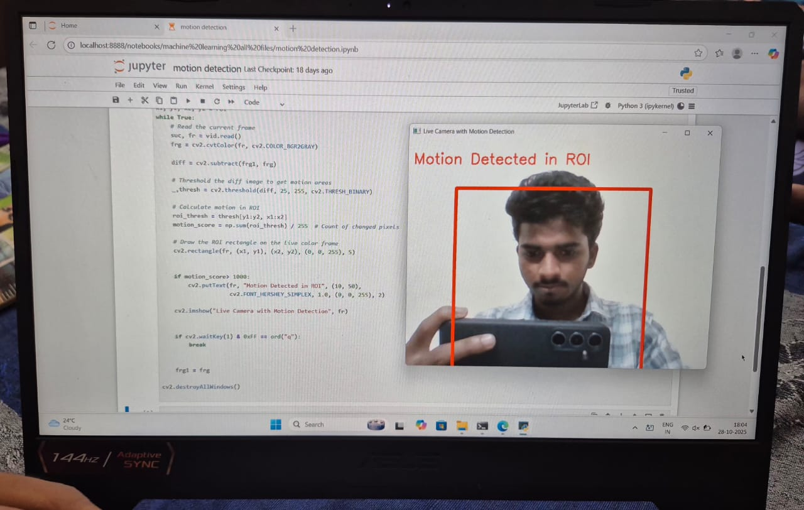

# 🎥 Motion Detection with OpenCV

A real-time motion detection system built with Python and OpenCV. Supports both **full-frame** motion detection and **Region of Interest (ROI)**-based detection using live webcam feed.

---

## 📸 Demo



---

## ✨ Features

- 🔴 **Real-time motion detection** from webcam feed
- 📦 **ROI-based detection** — monitor a specific zone in the frame
- 🖼️ Visual bounding box drawn around the Region of Interest
- 🏷️ On-screen alert text when motion is detected
- ⚡ Lightweight — frame differencing with thresholding (no ML required)

---

## 🛠️ Tech Stack

| Tool | Purpose |
|------|---------|
| Python 3.x | Core language |
| OpenCV (`cv2`) | Video capture, image processing |
| NumPy | Frame arithmetic & pixel counting |

---

## 📁 Project Structure

```
motion-detection/
│
├── motion-detection.ipynb   # Jupyter notebook with both detection modes
├── motion_detection_image.jpg  # Sample output screenshot
└── README.md
```

---

## 🚀 Getting Started

### Prerequisites

```bash
pip install opencv-python numpy
```

### Run the Notebook

```bash
jupyter notebook motion-detection.ipynb
```

Make sure your webcam is connected and accessible.

---

## 🔍 How It Works

### 1. Full-Frame Motion Detection

- Captures two consecutive grayscale frames
- Subtracts them pixel-by-pixel using `cv2.subtract()`
- If the total pixel difference exceeds a threshold (`> 1000`), motion is flagged

```python
diff = cv2.subtract(frg1, frg) / 255
if np.sum(diff) > 1000:
    cv2.putText(frg1, "motion detected", ...)
```

### 2. ROI-Based Motion Detection

- Defines a rectangular Region of Interest: `roi = (x1, y1, x2, y2)`
- Applies binary thresholding on the difference frame
- Counts changed pixels **only within the ROI**
- Draws a red rectangle around the ROI on the live feed

```python
roi = (100, 100, 200, 200)
roi_thresh = thresh[y1:y2, x1:x2]
motion_score = np.sum(roi_thresh) / 255
if motion_score > 1000:
    cv2.putText(fr, "Motion Detected in ROI", ...)
```

---

## ⌨️ Controls

| Key | Action |
|-----|--------|
| `q` | Quit the application |

---

## 🎛️ Configuration

You can tune the following parameters in the notebook:

| Parameter | Default | Description |
|-----------|---------|-------------|
| `roi` | `(100, 100, 200, 200)` | Region of Interest coordinates `(x1, y1, x2, y2)` |
| `motion threshold` | `1000` | Minimum pixel change count to trigger detection |
| `threshold value` | `25` | Sensitivity of frame difference binarization |

---

## 📌 Notes

- Lighting changes or camera shake can cause false positives — tune the threshold accordingly
- Increase the ROI size or lower the threshold for more sensitive detection
- The webcam index `0` refers to the default camera; change to `1`, `2`, etc. for external cameras

---

## 📄 License

This project is open-source and available under the [MIT License](LICENSE).

---

## 🙌 Acknowledgements

- [OpenCV Documentation](https://docs.opencv.org/)
- [NumPy Documentation](https://numpy.org/doc/)
